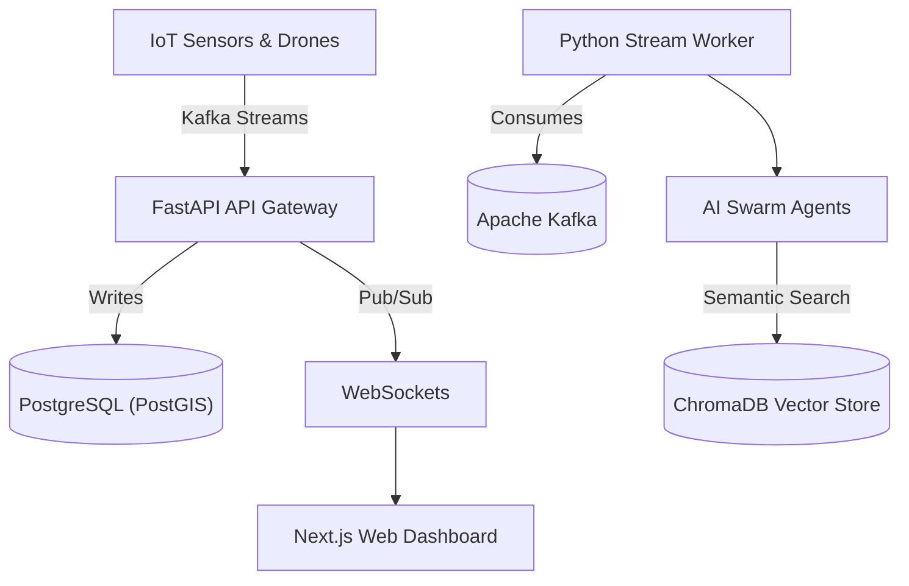

<div align="center">
  
  <h1>RailMind</h1>
  <p><strong>Next-Generation Autonomous Safety & Telemetry Platform for Indian Railways</strong></p>

  [](https://nextjs.org/)
  [](https://fastapi.tiangolo.com/)
  [](https://kafka.apache.org/)
  [](https://postgis.net/)
  [](https://redis.io/)
</div>

<hr/>

## 🚆 Overview

**RailMind** is an advanced, autonomous safety platform designed for high-scale railway infrastructure. By ingesting massive volumes of telemetry and sensor data via Apache Kafka, RailMind provides a real-time Command Center for monitoring train positions, predicting track fatigue, and responding to acoustic anomalies automatically. 

RailMind leverages specialized AI Multi-Agents capable of taking actions automatically without human intervention, ensuring optimal safety across the entire railway network.

## 🚀 Key Features

* **Real-Time Telemetry Streaming:** Millisecond latency for train positions and segment health using Kafka and WebSockets.
* **Acoustic Anomaly Detection:** Real-time processing of track-side acoustic sensors using a custom-trained Swin Transformer architecture to detect micro-cracks before they become fatal.
* **Autonomous AI Agents:** A distributed group of AI agents (Acoustic, Routing, Weather, Supervisor) that autonomously assess threats and recommend rerouting or maintenance dispatch.
* **Beautiful Command Center:** A highly optimized Next.js + Tailwind CSS UI that renders live geographic telemetry on top of map overlays.

---

## 🏗️ Architecture

RailMind is built with a modern microservices architecture optimized for extreme throughput and AI integration.



---

## 📂 Repository Structure

The project follows a standard scalable Monorepo structure:

```text
railmind/
├── apps/
│   ├── api/                 # FastAPI Backend & Kafka Workers
│   └── web/                 # Next.js Frontend Dashboard
├── infra/                   # Docker-compose configuration
├── ml/                      # Machine Learning pipelines
│   ├── data/                # Acoustic training datasets
│   ├── models/              # Pre-trained weights (.pth)
│   └── swin_transformer/    # Model architectures
└── packages/                # Shared utilities
```

---

## 🛠️ Quick Start

### Prerequisites
* Docker & Docker Compose
* Node.js v20+

### Deployment
To spin up the entire microservice stack locally (Postgres, Redis, Kafka, ChromaDB, API, and Background Worker):

```bash
cd infra
docker-compose up -d --build
```

### Start the Next.js Frontend

```bash
npm install
npm run dev
```
The Command Center will now be accessible at `http://localhost:3000`.

### Run the Telemetry Simulator
To test the real-time UI without physical trains, you can boot the live data simulator:
```bash
cd apps/api
python -m scripts.enhanced_simulator
```

---

## 📄 License
This project was developed for the Indian Railways Hackathon. All rights reserved.

<div align="center">
  <p>Built with ❤️ for Indian Railways</p>
</div>
