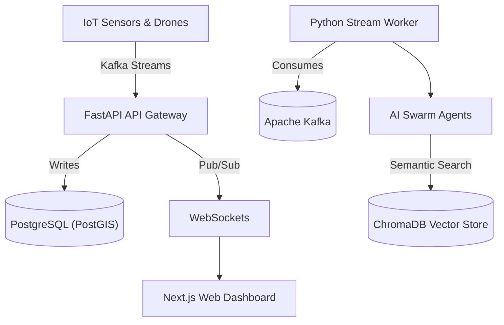

<div align="center">
  
  <h1>RailMind</h1>
  <p><strong>Next-Generation Autonomous Safety & Telemetry Platform for Railways</strong></p>

  [](https://nextjs.org/)
  [](https://fastapi.tiangolo.com/)
  [](https://kafka.apache.org/)
  [](https://postgis.net/)
  [](https://redis.io/)
</div>

<hr/>

## 🚆 Overview

**RailMind** is an advanced, autonomous safety platform designed for high-scale railway infrastructure. By ingesting massive volumes of telemetry and sensor data via Apache Kafka, RailMind provides a real-time Command Center for monitoring train positions, predicting track fatigue, and responding to acoustic anomalies automatically. 

RailMind leverages specialized AI Multi-Agents capable of taking actions automatically without human intervention, ensuring optimal safety across the entire railway network.

## 🚀 Key Features

* **Real-Time Telemetry Streaming:** Millisecond latency for train positions and segment health using Kafka and WebSockets.
* **Acoustic Anomaly Detection:** Real-time processing of track-side acoustic sensors using a custom-trained Swin Transformer architecture to detect micro-cracks before they become fatal.
* **Autonomous AI Agents:** A distributed group of AI agents (Acoustic, Routing, Weather, Supervisor) that autonomously assess threats and recommend rerouting or maintenance dispatch.
* **Beautiful Command Center:** A highly optimized Next.js + Tailwind CSS UI that renders live geographic telemetry on top of map overlays.

---

## 🏗️ Architecture

RailMind is built with a modern microservices architecture optimized for extreme throughput and AI integration.



---

## 📂 Repository Structure

The project follows a standard scalable Monorepo structure separating the frontend UI from the backend services and AI models:

```text
railmind/
├── frontend/                # Next.js UI, Tailwind CSS, package.json
├── backend/                 # FastAPI, Kafka config, Python scripts, docker-compose.yml
│   ├── api/                 # API Gateway routes and schemas
│   ├── ml/                  # Machine Learning pipelines and Swin Transformer
│   ├── services/            # Autonomous Agent business logic
│   └── scripts/             # Telemetry simulator scripts
└── docs/                    # Architecture diagrams and planning documents
```

---

## 🧠 Machine Learning Models

RailMind heavily relies on a custom-trained **Swin Transformer** architecture for Audio/Acoustic Anomaly Detection. Track-side sensors record acoustic signatures which are converted to spectrograms and processed to identify micro-cracks or faults in the tracks.

> **Note:** Due to GitHub's 100MB file size limit, the heavy pre-trained model weights (`acoustic_demo.pth`) are hosted externally. [Insert Google Drive Link Here]

---

## 🛠️ Local Setup (Quick Start)

### Prerequisites
* Docker & Docker Compose
* Node.js v20+
* Python 3.12+

### 1. Start the Backend Infrastructure
Navigate into the `backend/` directory to spin up the entire microservice stack (PostgreSQL, Redis, Kafka, ChromaDB, and FastAPI):

```bash
cd backend
docker-compose up -d --build
```

### 2. Run the Telemetry Simulator
To test the real-time UI without physical trains, boot the live data simulator from the backend directory:

```bash
cd backend
python -m scripts.enhanced_simulator
```

### 3. Start the Next.js Frontend
Open a new terminal, navigate to the `frontend/` directory, and start the UI:

```bash
cd frontend
npm install
npm run dev
```
The Command Center will now be accessible at `http://localhost:3000`.

---

## 🌐 Production Deployment

For enterprise-grade deployment:
* **Frontend:** Deployed and hosted globally on **Vercel** for optimal edge-caching and low latency.
* **Backend:** Microservices (FastAPI, Kafka, PostgreSQL, Redis, ChromaDB) are containerized and orchestrated on a **DigitalOcean Droplet** via Docker Compose.

---

## 📄 License
This project was developed for the Indian Railways Hackathon. All rights reserved.

<div align="center">
  <p>Built with ❤️ for Indian Railways</p>
</div>
